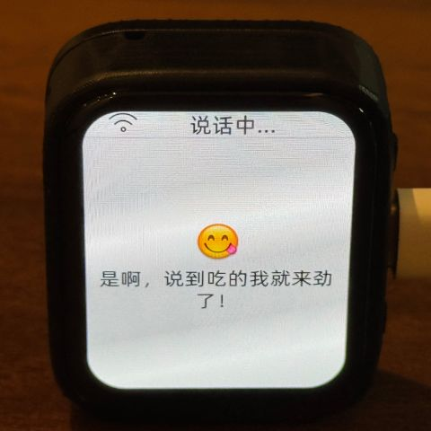
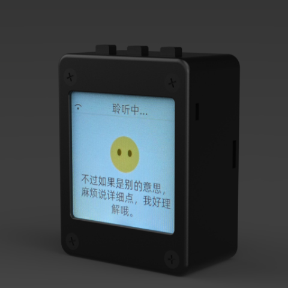

# Um chatbot baseado em MCP

(Português | [English](README.md) | [日本語](README_ja.md))

## Introdução

👉 [Humano: colocar uma câmera no AI vs AI: descobrir que o dono não lavou o cabelo por três dias no lugar【bilibili】](https://www.bilibili.com/video/BV1bpjgzKEhd/)

👉 [Construa manualmente sua namorada AI, tutorial para iniciantes【bilibili】](https://www.bilibili.com/video/BV1XnmFYLEJN/)

O chatbot Xiaozhi AI serve como uma interface de voz e, usando os recursos de grandes modelos como Qwen / DeepSeek, implementa controle multi-plataforma por meio do protocolo MCP.

### Observações sobre versões

A versão v2 atual não é compatível na tabela de partições com a versão v1, portanto não é possível atualizar de v1 para v2 via OTA. Consulte a tabela de partições em [partitions/v2/README.md](partitions/v2/README.md).

Hardware compatível com a versão v1 pode ser atualizado manualmente para a versão v2 através da gravação do firmware.

A versão estável v1 é 1.9.2, e você pode alternar para ela com `git checkout v1`. Esse branch será mantido até fevereiro de 2026.

### Funcionalidades implementadas

- Wi-Fi / ML307 Cat.1 4G
- Despertar por voz offline com [ESP-SR](https://github.com/espressif/esp-sr)
- Suporte a dois protocolos de comunicação ([Websocket](docs/websocket_zh.md) ou MQTT+UDP)
- Codec de áudio OPUS
- Interação de voz com arquitetura de ASR em streaming + LLM + TTS
- Reconhecimento de voz/biometria para identificar o falante com [3D Speaker](https://github.com/modelscope/3D-Speaker)
- Tela OLED / LCD com suporte a exibição de emoticons
- Indicador de bateria e gerenciamento de energia
- Suporte a várias línguas (chinês, inglês, japonês)
- Suporte a plataformas ESP32-C3, ESP32-S3, ESP32-P4
- Controle de dispositivo via MCP no dispositivo (volume, iluminação, motor, GPIO, etc.)
- Expansão de capacidades do grande modelo via MCP na nuvem (controle de casa inteligente, operação de desktop, pesquisa de conhecimento, envio e recebimento de e-mails, etc.)
- Palavras de ativação, fontes, emoticons e fundos de chat personalizados, com suporte a edição online via navegador ([gerador de Assets personalizado](https://github.com/78/xiaozhi-assets-generator))

## Hardware

### Montagem manual em breadboard

Veja o tutorial no Feishu:

👉 ["Enciclopédia do chatbot Xiaozhi AI" ](https://ccnphfhqs21z.feishu.cn/wiki/F5krwD16viZoF0kKkvDcrZNYnhb?from=from_copylink)

A imagem do breadboard é a seguinte:

### Suporta mais de 70 hardwares de código aberto (apenas alguns mostrados)

- <a href="https://oshwhub.com/li-chuang-kai-fa-ban/li-chuang-shi-zhan-pai-esp32-s3-kai-fa-ban" target="_blank" title="立创·实战派 ESP32-S3 开发板">Placa de desenvolvimento ESP32-S3 Lichuang</a>
- <a href="https://github.com/espressif/esp-box" target="_blank" title="乐鑫 ESP32-S3-BOX3">Espressif ESP32-S3-BOX3</a>
- <a href="https://docs.m5stack.com/zh_CN/core/CoreS3" target="_blank" title="M5Stack CoreS3">M5Stack CoreS3</a>
- <a href="https://docs.m5stack.com/en/atom/Atomic%20Echo%20Base" target="_blank" title="AtomS3R + Echo Base">M5Stack AtomS3R + Echo Base</a>
- <a href="https://gf.bilibili.com/item/detail/1108782064" target="_blank" title="神奇按钮 2.4">Botão mágico 2.4</a>
- <a href="https://www.waveshare.net/shop/ESP32-S3-Touch-AMOLED-1.8.htm" target="_blank" title="微雪电子 ESP32-S3-Touch-AMOLED-1.8">Waveshare ESP32-S3-Touch-AMOLED-1.8</a>
- <a href="https://github.com/Xinyuan-LilyGO/T-Circle-S3" target="_blank" title="LILYGO T-Circle-S3">LILYGO T-Circle-S3</a>
- <a href="https://oshwhub.com/tenclass01/xmini_c3" target="_blank" title="虾哥 Mini C3">Xiaoge Mini C3</a>
- <a href="https://oshwhub.com/movecall/cuican-ai-pendant-lights-up-y" target="_blank" title="Movecall CuiCan ESP32S3">Movecall CuiCan ESP32S3</a>
- <a href="https://github.com/WMnologo/xingzhi-ai" target="_blank" title="无名科技Nologo-星智-1.54">Nologo Xingzhi 1.54</a>
- <a href="https://www.seeedstudio.com/SenseCAP-Watcher-W1-A-p-5979.html" target="_blank" title="SenseCAP Watcher">SenseCAP Watcher</a>
- <a href="https://www.bilibili.com/video/BV1BHJtz6E2S/" target="_blank" title="ESP-HI 超低成本机器狗">ESP-HI robô de baixo custo</a>

  
  
  
  
  
  
  
  
  
  
  
  

## Software

### Gravação de firmware

Para quem está começando pela primeira vez, recomendamos não configurar o ambiente de desenvolvimento e usar o firmware pré-compilado para gravação.

O firmware usa por padrão o servidor oficial [xiaozhi.me](https://xiaozhi.me). Usuários pessoais podem se cadastrar gratuitamente para usar o modelo em tempo real Qwen.

👉 [Tutorial de gravação de firmware para iniciantes](https://ccnphfhqs21z.feishu.cn/wiki/Zpz4wXBtdimBrLk25WdcXzxcnNS)

### Ambiente de desenvolvimento

- Cursor ou VSCode
- Instale a extensão ESP-IDF e escolha versão do SDK 5.4 ou superior
- Linux é melhor que Windows, pois compila mais rápido e evita problemas de driver
- Este projeto segue o estilo de código Google C++; ao enviar código, certifique-se de estar conforme as normas

### Documentação para desenvolvedores

- [Guia de placa personalizada](docs/custom-board_zh.md) - aprenda a criar uma placa personalizada para Xiaozhi AI
- [Como usar MCP para controle de IoT](docs/mcp-usage_zh.md) - entenda como controlar dispositivos IoT via MCP
- [Fluxo de interação do protocolo MCP](docs/mcp-protocol_zh.md) - implementação do protocolo MCP no dispositivo
- [Documento do protocolo MQTT + UDP](docs/mqtt-udp_zh.md)
- [Documento detalhado do protocolo WebSocket](docs/websocket_zh.md)

## Configuração de grande modelo

Se você já possui um dispositivo chatbot Xiaozhi AI e está conectado ao servidor oficial, pode fazer a configuração no console em [xiaozhi.me](https://xiaozhi.me).

👉 [Tutorial em vídeo do console (interface antiga)](https://www.bilibili.com/video/BV1jUCUY2EKM/)

## Projetos open source relacionados

Para implantar o servidor em um PC pessoal, você pode consultar os seguintes projetos de terceiros:

- [xinnan-tech/xiaozhi-esp32-server](https://github.com/xinnan-tech/xiaozhi-esp32-server) servidor Python
- [joey-zhou/xiaozhi-esp32-server-java](https://github.com/joey-zhou/xiaozhi-esp32-server-java) servidor Java
- [AnimeAIChat/xiaozhi-server-go](https://github.com/AnimeAIChat/xiaozhi-server-go) servidor Golang
- [hackers365/xiaozhi-esp32-server-golang](https://github.com/hackers365/xiaozhi-esp32-server-golang) servidor Golang

Projetos cliente de terceiros que usam o protocolo Xiaozhi:

- [huangjunsen0406/py-xiaozhi](https://github.com/huangjunsen0406/py-xiaozhi) cliente Python
- [TOM88812/xiaozhi-android-client](https://github.com/TOM88812/xiaozhi-android-client) cliente Android
- [100askTeam/xiaozhi-linux](http://github.com/100askTeam/xiaozhi-linux) cliente Linux do Baiwen Tech
- [78/xiaozhi-sf32](https://github.com/78/xiaozhi-sf32) firmware para chip Bluetooth
- [QuecPython/solution-xiaozhiAI](https://github.com/QuecPython/solution-xiaozhiAI) firmware QuecPython fornecido pela Quectel

## Sobre o projeto

Este é um projeto ESP32 de código aberto mantido por Xiaoge, lançado sob licença MIT. Permite que qualquer pessoa use, modifique ou use comercialmente gratuitamente.

Esperamos que este projeto ajude a entender o desenvolvimento de hardware AI e aplicar os grandes modelos de linguagem em dispositivos reais.

Se você tiver ideias ou sugestões, abra uma issue ou junte-se ao [Discord](https://discord.gg/C759fGMBcZ) ou ao grupo QQ: 1011329060

## Star History

<a href="https://star-history.com/#78/xiaozhi-esp32&Date">
 <picture>
   <source media="(prefers-color-scheme: dark)" srcset="https://api.star-history.com/svg?repos=78/xiaozhi-esp32&type=Date&theme=dark" />
   <source media="(prefers-color-scheme: light)" srcset="https://api.star-history.com/svg?repos=78/xiaozhi-esp32&type=Date" />
   
 </picture>
</a>
