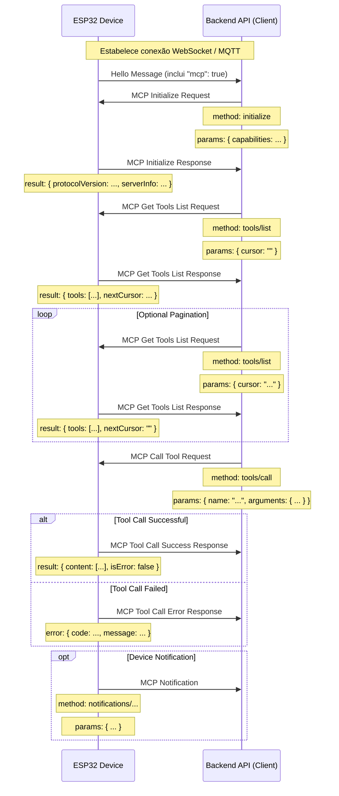

# Fluxo de interação MCP (Model Context Protocol)

NOTICE: gerado com assistência de AI. Ao implementar o backend, confirme os detalhes no código!

No projeto, o protocolo MCP é usado para comunicação entre a API do backend (cliente MCP) e o dispositivo ESP32 (servidor MCP), permitindo que o backend descubra e invoque funcionalidades fornecidas pelo dispositivo (ferramentas).

## Formato do protocolo

De acordo com o código (`main/protocols/protocol.cc`, `main/mcp_server.cc`), as mensagens MCP são encapsuladas no corpo da comunicação base (por exemplo, WebSocket ou MQTT). A estrutura interna segue a especificação [JSON-RPC 2.0](https://www.jsonrpc.org/specification).

Exemplo geral de mensagem:

```json
{
  "session_id": "...", // ID da sessão
  "type": "mcp",       // Tipo de mensagem, fixo como "mcp"
  "payload": {         // Payload JSON-RPC 2.0
    "jsonrpc": "2.0",
    "method": "...",   // Nome do método (por exemplo, "initialize", "tools/list", "tools/call")
    "params": { ... }, // Parâmetros do método (em requests)
    "id": ...,         // ID da requisição (em requests e responses)
    "result": { ... }, // Resultado da execução (em success response)
    "error": { ... }   // Erro (em error response)
  }
}
```

A parte `payload` é uma mensagem JSON-RPC 2.0 padrão:

- `jsonrpc`: string fixa `"2.0"`.
- `method`: nome do método a ser chamado (em requests).
- `params`: parâmetros do método, tipicamente um objeto (em requests).
- `id`: identificador da requisição; o servidor retorna o mesmo valor na resposta para correspondência.
- `result`: resultado quando o método é executado com sucesso.
- `error`: informação de erro quando a execução falha.

## Fluxo de interação e momentos de envio

A interação MCP gira em torno do backend descobrindo e chamando as ferramentas do dispositivo.

1.  **Estabelecimento de conexão e anúncio de capacidades**

    - **Quando:** após o dispositivo iniciar e conectar com sucesso ao backend.
    - **Quem envia:** dispositivo.
    - **O que envia:** mensagem `hello` no protocolo base, indicando as capacidades suportadas, por exemplo, `"mcp": true`.
    - **Exemplo (não é payload MCP, mas mensagem do protocolo base):**
      ```json
      {
        "type": "hello",
        "version": ...,
        "features": {
          "mcp": true,
          ...
        },
        "transport": "websocket", // ou "mqtt"
        "audio_params": { ... },
        "session_id": "..." // pode ser definido após receber o hello do servidor
      }
      ```

2.  **Inicialização da sessão MCP**

    - **Quando:** o backend recebe o `hello` do dispositivo e confirma suporte a MCP; geralmente é o primeiro request MCP.
    - **Quem envia:** backend (cliente).
    - **Método:** `initialize`
    - **Payload MCP:**

      ```json
      {
        "jsonrpc": "2.0",
        "method": "initialize",
        "params": {
          "capabilities": {
            // capacidades opcionais do cliente

            "vision": {
              "url": "...", // câmera: URL de processamento de imagem (deve ser HTTP, não WebSocket)
              "token": "..." // token da URL
            }

            // ... outras capacidades do cliente
          }
        },
        "id": 1
      }
      ```

    - **Quando o dispositivo responde:** após processar o request `initialize`.
    - **Resposta do dispositivo:**
      ```json
      {
        "jsonrpc": "2.0",
        "id": 1,
        "result": {
          "protocolVersion": "2024-11-05",
          "capabilities": {
            "tools": {} // pode não listar detalhes aqui; use tools/list
          },
          "serverInfo": {
            "name": "...", // nome do dispositivo (BOARD_NAME)
            "version": "..." // versão do firmware
          }
        }
      }
      ```

3.  **Descoberta da lista de ferramentas do dispositivo**

    - **Quando:** quando o backend precisa saber quais funcionalidades o dispositivo suporta.
    - **Quem envia:** backend (cliente).
    - **Método:** `tools/list`
    - **Payload MCP:**
      ```json
      {
        "jsonrpc": "2.0",
        "method": "tools/list",
        "params": {
          "cursor": "" // usado para paginação; string vazia na primeira requisição
        },
        "id": 2
      }
      ```
    - **Quando o dispositivo responde:** após gerar a lista de ferramentas.
    - **Resposta do dispositivo:**
      ```json
      {
        "jsonrpc": "2.0",
        "id": 2,
        "result": {
          "tools": [
            {
              "name": "self.get_device_status",
              "description": "...",
              "inputSchema": { ... }
            },
            {
              "name": "self.audio_speaker.set_volume",
              "description": "...",
              "inputSchema": { ... }
            }
            // ... mais ferramentas
          ],
          "nextCursor": "..." // cursor para a próxima página, se houver
        }
      }
      ```
    - **Paginação:** se `nextCursor` não estiver vazio, o cliente deve enviar outro `tools/list` com esse cursor em `params`.

4.  **Chamar uma ferramenta do dispositivo**

    - **Quando:** o backend precisa executar uma funcionalidade específica no dispositivo.
    - **Quem envia:** backend (cliente).
    - **Método:** `tools/call`
    - **Payload MCP:**
      ```json
      {
        "jsonrpc": "2.0",
        "method": "tools/call",
        "params": {
          "name": "self.audio_speaker.set_volume",
          "arguments": {
            "volume": 50
          }
        },
        "id": 3
      }
      ```
    - **Quando o dispositivo responde:** após executar a ferramenta.
    - **Resposta de sucesso:**
      ```json
      {
        "jsonrpc": "2.0",
        "id": 3,
        "result": {
          "content": [
            { "type": "text", "text": "true" }
          ],
          "isError": false
        }
      }
      ```
    - **Resposta de erro:**
      ```json
      {
        "jsonrpc": "2.0",
        "id": 3,
        "error": {
          "code": -32601,
          "message": "Unknown tool: self.non_existent_tool"
        }
      }
      ```

5.  **Dispositivo envia notificações ativas**
    - **Quando:** quando o dispositivo precisa notificar o backend sobre um evento interno (por exemplo, mudança de estado). O código não mostra uma ferramenta explícita, mas `Application::SendMcpMessage` sugere que o dispositivo pode enviar mensagens MCP ativas.
    - **Quem envia:** dispositivo (servidor).
    - **Método:** pode começar com `notifications/` ou outro tipo customizado.
    - **Payload MCP:** formato de notificação JSON-RPC, sem campo `id`.
      ```json
      {
        "jsonrpc": "2.0",
        "method": "notifications/state_changed",
        "params": {
          "newState": "idle",
          "oldState": "connecting"
        }
      }
      ```
    - **Como o backend trata:** processa a notificação sem enviar resposta.

## Diagrama de interação

Abaixo está um diagrama simplificado mostrando o fluxo principal de mensagens MCP:



Este documento descreve o fluxo principal do protocolo MCP neste projeto. Consulte `main/mcp_server.cc` em `McpServer::AddCommonTools` e as implementações de cada ferramenta para detalhes de parâmetros e funcionalidades.


    opt Device Notification
        Device->>BackendAPI: MCP Notification
        Note over Device: method: notifications/...
        Note over Device: params: { ... }
    end
```

这份文档概述了该项目中 MCP 协议的主要交互流程。具体的参数细节和工具功能需要参考 `main/mcp_server.cc` 中 `McpServer::AddCommonTools` 以及各个工具的实现。
