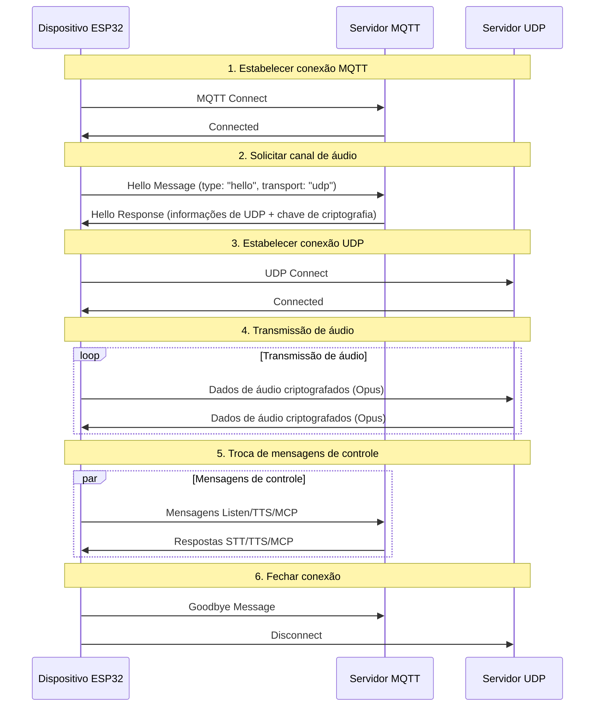
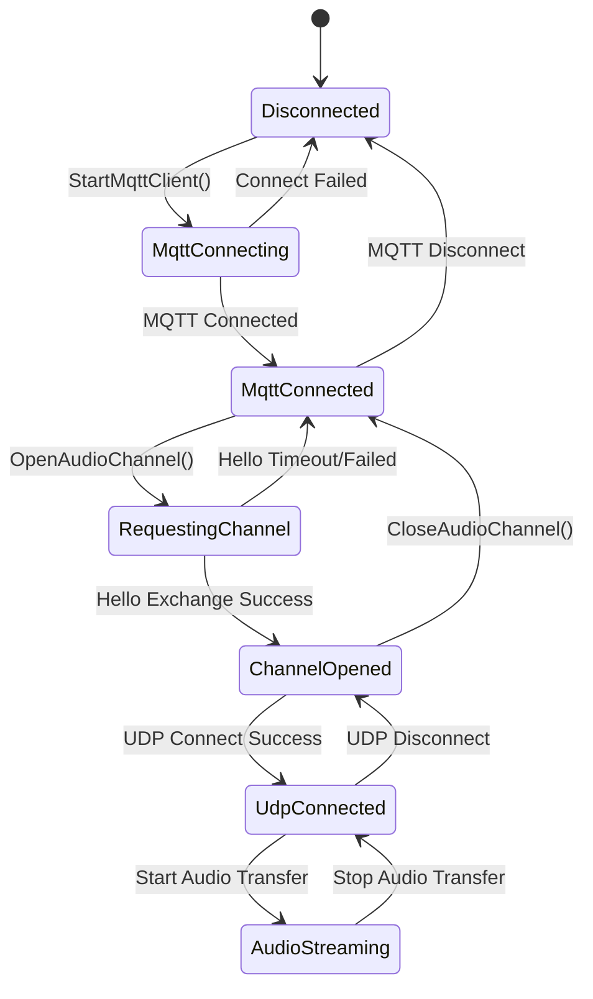

# Documento do protocolo híbrido MQTT + UDP

Este documento resume o protocolo híbrido MQTT + UDP usado no projeto. Ele descreve como o dispositivo e o servidor trocam mensagens de controle via MQTT e transmitem áudio em tempo real via UDP.

---

## 1. Visão geral do protocolo

O protocolo usa transporte híbrido:
- **MQTT**: para mensagens de controle, sincronização de estado e troca de dados JSON
- **UDP**: para transmissão de áudio em tempo real, com suporte a criptografia

### 1.1 Características do protocolo

- **Design de canal duplo**: separa controle e dados, garantindo melhor tempo real
- **Transmissão criptografada**: áudio UDP é criptografado com AES-CTR
- **Proteção por sequência**: evita reprodução e reordenação de pacotes
- **Reconexão automática**: reconexão automática do MQTT após queda

---

## 2. Fluxo geral



---

## 3. Canal de controle MQTT

### 3.1 Estabelecimento de conexão

O dispositivo conecta ao servidor MQTT usando os seguintes parâmetros:
- **Endpoint**: endereço e porta do servidor MQTT
- **Client ID**: identificador único do dispositivo
- **Username/Password**: credenciais de autenticação
- **Keep Alive**: intervalo de heartbeat (padrão 240 segundos)

### 3.2 Troca de mensagem Hello

#### 3.2.1 Dispositivo envia Hello

```json
{
  "type": "hello",
  "version": 3,
  "transport": "udp",
  "features": {
    "mcp": true
  },
  "audio_params": {
    "format": "opus",
    "sample_rate": 16000,
    "channels": 1,
    "frame_duration": 60
  }
}
```

#### 3.2.2 Servidor responde Hello

```json
{
  "type": "hello",
  "transport": "udp",
  "session_id": "xxx",
  "audio_params": {
    "format": "opus",
    "sample_rate": 24000,
    "channels": 1,
    "frame_duration": 60
  },
  "udp": {
    "server": "192.168.1.100",
    "port": 8888,
    "key": "0123456789ABCDEF0123456789ABCDEF",
    "nonce": "0123456789ABCDEF0123456789ABCDEF"
  }
}
```

**Campos:**
- `udp.server`: endereço do servidor UDP
- `udp.port`: porta do servidor UDP
- `udp.key`: chave AES em hex
- `udp.nonce`: nonce AES em hex

### 3.3 Tipos de mensagens JSON

#### 3.3.1 Dispositivo → Servidor

1. **Mensagem Listen**
   ```json
   {
     "session_id": "xxx",
     "type": "listen",
     "state": "start",
     "mode": "manual"
   }
   ```

2. **Mensagem Abort**
   ```json
   {
     "session_id": "xxx",
     "type": "abort",
     "reason": "wake_word_detected"
   }
   ```

3. **Mensagem MCP**
   ```json
   {
     "session_id": "xxx",
     "type": "mcp",
     "payload": {
       "jsonrpc": "2.0",
       "id": 1,
       "result": {...}
     }
   }
   ```

4. **Mensagem Goodbye**
   ```json
   {
     "session_id": "xxx",
     "type": "goodbye"
   }
   ```

#### 3.3.2 Servidor → Dispositivo

Os tipos de mensagens são compatíveis com o protocolo WebSocket e incluem:
- **STT**: resultado de reconhecimento de fala
- **TTS**: controle de síntese de voz
- **LLM**: controle de expressão de sentimento
- **MCP**: controle IoT
- **System**: controle de sistema
- **Custom**: mensagem personalizada (opcional)

---

## 4. Canal de áudio UDP

### 4.1 Estabelecimento de conexão

Após receber o Hello do MQTT, o dispositivo usa as informações UDP para abrir o canal de áudio:
1. Analisa o endereço e a porta do servidor UDP
2. Analisa a chave e o nonce de criptografia
3. Inicializa o contexto AES-CTR
4. Estabelece a conexão UDP

### 4.2 Formato dos dados de áudio

#### 4.2.1 Estrutura do pacote de áudio criptografado

```
|type 1byte|flags 1byte|payload_len 2bytes|ssrc 4bytes|timestamp 4bytes|sequence 4bytes|
|payload payload_len bytes|
```

**Campos:**
- `type`: tipo do pacote, fixo em 0x01
- `flags`: flags, atualmente não usadas
- `payload_len`: comprimento do payload (ordem de bytes de rede)
- `ssrc`: identificador de fonte de sincronização
- `timestamp`: timestamp (ordem de bytes de rede)
- `sequence`: número de sequência (ordem de bytes de rede)
- `payload`: dados de áudio Opus criptografados

#### 4.2.2 Algoritmo de criptografia

Usa AES-CTR:
- **chave**: 128 bits fornecida pelo servidor
- **nonce**: 128 bits fornecido pelo servidor
- **contador**: inclui timestamp e número de sequência

### 4.3 Gestão de sequência

- **Sender**: `local_sequence_` incrementa monotonicamente
- **Receiver**: `remote_sequence_` valida a continuidade
- **Proteção anti-replay**: rejeita pacotes com sequência menor que o esperado
- **Tolerância**: permite saltos leves de sequência e registra avisos

### 4.4 Tratamento de erros

1. **Falha de decriptação**: registra erro e descarta o pacote
2. **Seqüência anômala**: registra aviso, mas pode processar o pacote
3. **Formato de pacote inválido**: registra erro e descarta o pacote

---

## 5. Gerenciamento de estado

### 5.1 Estado da conexão



### 5.2 Verificação de estado

O dispositivo verifica se o canal de áudio está disponível com:
```cpp
bool IsAudioChannelOpened() const {
    return udp_ != nullptr && !error_occurred_ && !IsTimeout();
}
```

---

## 6. Parâmetros de configuração

### 6.1 Configuração MQTT

As opções lidas nas configurações são:
- `endpoint`: endereço do servidor MQTT
- `client_id`: identificador do cliente
- `username`: nome de usuário
- `password`: senha
- `keepalive`: intervalo de heartbeat (padrão 240 segundos)
- `publish_topic`: tópico de publicação

### 6.2 Parâmetros de áudio

- **Formato**: Opus
- **Taxa de amostragem**: 16000 Hz (dispositivo) / 24000 Hz (servidor)
- **Canais**: 1 (mono)
- **Duração do quadro**: 60 ms

---

## 7. Tratamento de erros e reconexão

### 7.1 Mecanismo de reconexão MQTT

- reconexão automática em caso de falha de conexão
- suporte a controle de relatório de erro
- gatilho de limpeza ao desconectar

### 7.2 Gerenciamento da conexão UDP

- não reconecta automaticamente em caso de falha
- depende do canal MQTT para renegociação
- suporta consulta do estado da conexão

### 7.3 Tratamento de timeout

A classe base `Protocol` fornece detecção de timeout:
- tempo limite padrão: 120 segundos
- calculado com base no último recebimento
- marca o canal como indisponível quando expira

---

## 8. Considerações de segurança

### 8.1 Criptografia de transporte

- **MQTT**: suporta TLS/SSL (porta 8883)
- **UDP**: usa AES-CTR para criptografar áudio

### 8.2 Mecanismo de autenticação

- **MQTT**: autenticação por usuário/senha
- **UDP**: chave distribuída via canal MQTT

### 8.3 Proteção contra replay

- número de sequência monotonicamente crescente
- rejeição de pacotes expirados
- validação de timestamp

---

## 9. Otimização de desempenho

### 9.1 Controle de concorrência

Proteção da conexão UDP com mutex:
```cpp
std::lock_guard<std::mutex> lock(channel_mutex_);
```

### 9.2 Gestão de memória

- criação/destruição dinâmica de objetos de rede
- uso de smart pointers para pacotes de áudio
- liberação oportuna do contexto de criptografia

### 9.3 Otimização de rede

- reutilização da conexão UDP
- otimização do tamanho dos pacotes
- verificação de continuidade da sequência

---

## 10. Comparação com o protocolo WebSocket

| Recurso | MQTT + UDP | WebSocket |
|------|------------|-----------|
| Canal de controle | MQTT | WebSocket |
| Canal de áudio | UDP (criptografado) | WebSocket (binário) |
| Tempo real | Alto (UDP) | Médio |
| Confiabilidade | Média | Alta |
| Complexidade | Alta | Baixa |
| Criptografia | AES-CTR | TLS |
| Compatibilidade com firewall | Baixa | Alta |

---

## 11. Recomendações de implantação

### 11.1 Ambiente de rede

- garanta que a porta UDP esteja acessível
- configure regras de firewall
- considere NAT traversal

### 11.2 Configuração do servidor

- configuração do broker MQTT
- implantação do servidor UDP
- sistema de gerenciamento de chaves

### 11.3 Métricas de monitoramento

- taxa de sucesso de conexão
- latência de transmissão de áudio
- taxa de perda de pacotes
- taxa de falha de descriptografia

---

## 12. Conclusão

O protocolo híbrido MQTT + UDP oferece comunicação de áudio e controle eficiente através de:

- **Arquitetura separada**: separa os canais de controle e dados
- **Proteção criptográfica**: AES-CTR garante a segurança do áudio
- **Gestão de sequência**: evita replay e reordenação de pacotes
- **Recuperação automática**: suporta reconexão após desconexões
- **Otimização de desempenho**: UDP oferece baixa latência para áudio

Este protocolo é adequado para cenários de interação por voz com alta exigência de tempo real, mas exige um equilíbrio entre complexidade de rede e desempenho de transmissão. 