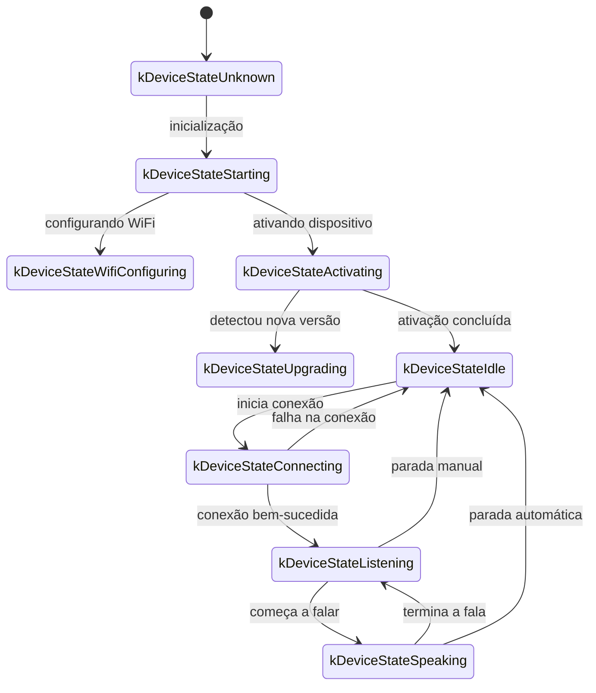
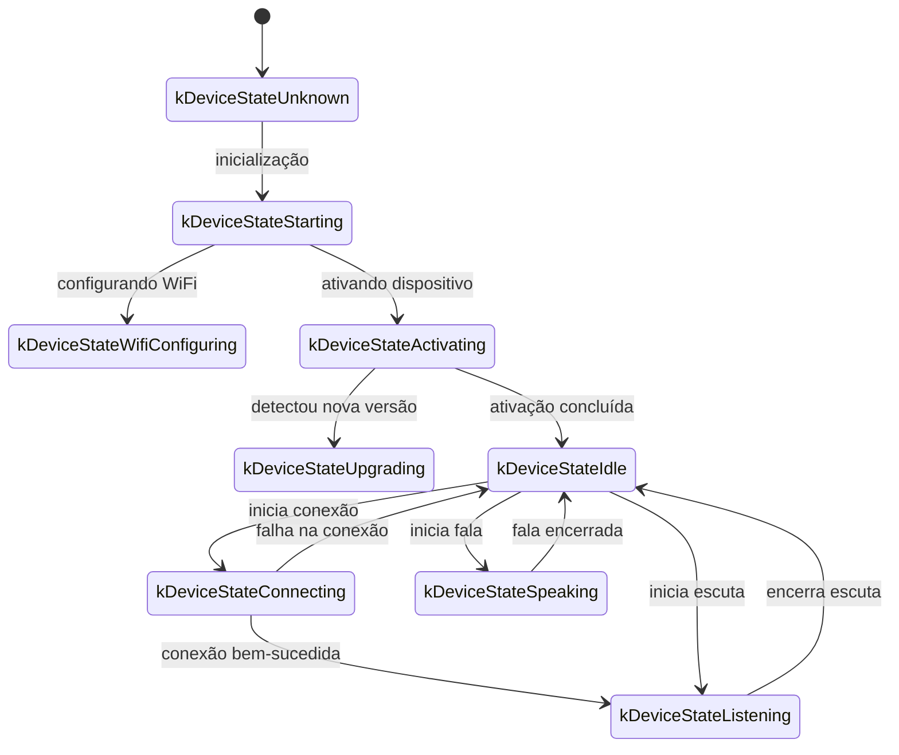
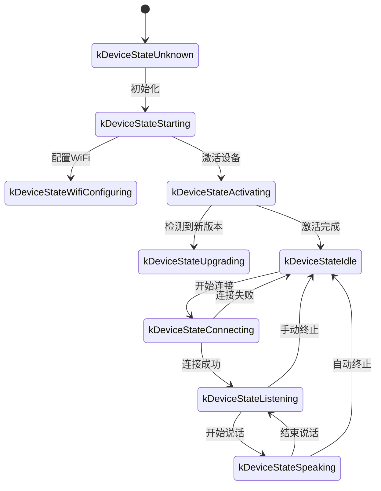
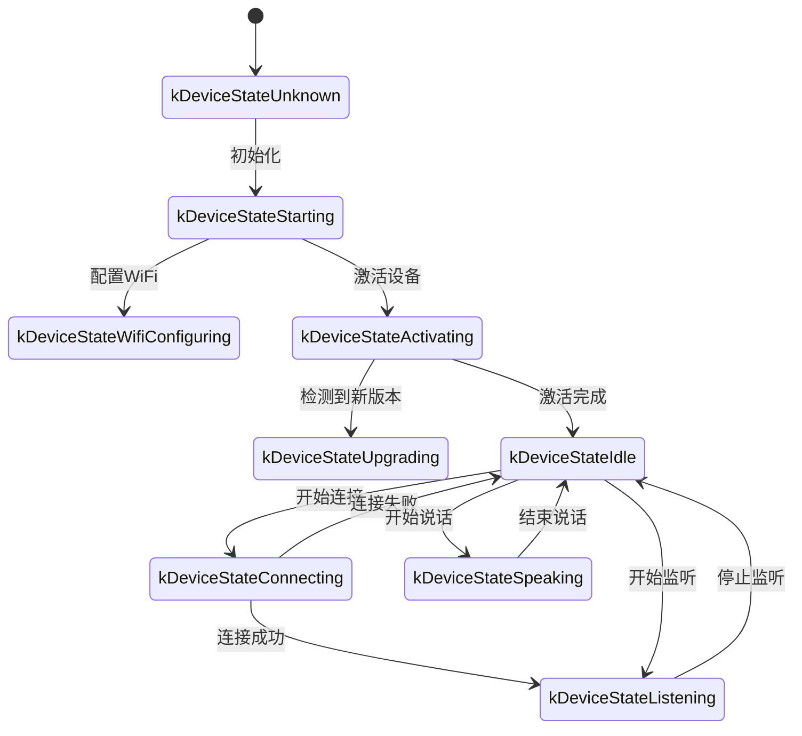

A seguir está um documento baseado na implementação do código para descrever o protocolo de comunicação WebSocket, explicando como o dispositivo e o servidor interagem via WebSocket.

Este documento é uma inferência a partir do código fornecido; em implantação real, pode ser necessário confirmar ou complementar com a implementação do servidor.

---

## 1. Visão geral do fluxo

1. **Inicialização do dispositivo**
   - O dispositivo liga e inicializa a `Application`:
     - inicializa codec de áudio, display, LEDs, etc.
     - conecta à rede
     - cria e inicializa uma instância do protocolo WebSocket que implementa a interface `Protocol` (`WebsocketProtocol`)
   - entra no loop principal aguardando eventos (entrada/saída de áudio, tarefas agendadas, etc.).

2. **Estabelecimento da conexão WebSocket**
   - Quando o dispositivo precisa iniciar uma sessão de voz (por exemplo, ativação por voz ou pressionamento de botão), chama `OpenAudioChannel()`:
     - obtém a URL do WebSocket a partir da configuração
     - define cabeçalhos de requisição como `Authorization`, `Protocol-Version`, `Device-Id` e `Client-Id`
     - chama `Connect()` para estabelecer a conexão com o servidor

3. **Dispositivo envia mensagem "hello"**
   - Após a conexão, o dispositivo envia uma mensagem JSON. Exemplo:
     ```json
     {
       "type": "hello",
       "version": 1,
       "features": {
         "mcp": true
       },
       "transport": "websocket",
       "audio_params": {
         "format": "opus",
         "sample_rate": 16000,
         "channels": 1,
         "frame_duration": 60
       }
     }
     ```
   - O campo `features` é opcional e pode ser gerado automaticamente com base nas configurações de compilação do dispositivo. Por exemplo, `"mcp": true` indica suporte a MCP.
   - `frame_duration` corresponde a `OPUS_FRAME_DURATION_MS` (por exemplo, 60 ms).

4. **Servidor responde com "hello"**
   - O dispositivo aguarda do servidor uma mensagem JSON contendo `"type": "hello"` e verifica se `"transport": "websocket"` corresponde.
   - O servidor pode enviar opcionalmente `session_id`; o dispositivo registra esse valor automaticamente.
   - Exemplo:
     ```json
     {
       "type": "hello",
       "transport": "websocket",
       "session_id": "xxx",
       "audio_params": {
         "format": "opus",
         "sample_rate": 24000,
         "channels": 1,
         "frame_duration": 60
       }
     }
     ```
   - Se corresponder, o servidor é considerado pronto e o canal de áudio é marcado como aberto.
   - Se não receber a resposta correta dentro do timeout (padrão 10 s), a conexão é considerada falha e a rotina de erro de rede é acionada.

5. **Interação subsequente**
   - O dispositivo e o servidor trocam dois tipos principais de dados:
     1. **Dados binários de áudio** (Opus)
     2. **Mensagens JSON em texto** (para estado de chat, eventos TTS/STT, mensagens MCP, etc.)

   - No código, o callback de recebimento lida com:
     - `OnData(...)`:
       - se `binary` for `true`, trata como quadro de áudio e decodifica como Opus
       - se `binary` for `false`, trata como texto JSON, parseia com cJSON e executa lógica de negócio (chat, TTS, MCP, etc.)

   - Se o servidor ou a rede desconectar, `OnDisconnected()` é acionado:
     - o dispositivo chama `on_audio_channel_closed_()` e retorna ao estado ocioso.

6. **Fechamento da conexão WebSocket**
   - Quando a sessão de voz termina, o dispositivo chama `CloseAudioChannel()` para encerrar a conexão e voltar ao estado ocioso.
   - Se o servidor encerrar a conexão, a mesma sequência de callbacks é executada.

---

## 2. Cabeçalhos comuns

Durante o handshake WebSocket, o código define os seguintes cabeçalhos:

- `Authorization`: token de acesso no formato `"Bearer <token>"`
- `Protocol-Version`: versão do protocolo, consistente com o campo `version` na mensagem hello
- `Device-Id`: endereço MAC da interface de rede do dispositivo
- `Client-Id`: UUID gerado pelo software (pode ser redefinido se o NVS for apagado ou o firmware regravado)

Esses cabeçalhos são enviados com a handshake do WebSocket, e o servidor pode usá-los para validação e autenticação.

---

## 3. Versões do protocolo binário

O dispositivo suporta diferentes versões do protocolo binário, selecionadas pelo campo `version` nas configurações:

### 3.1 Versão 1 (padrão)
Envia diretamente dados Opus sem metadados adicionais. O WebSocket diferencia text de binary.

### 3.2 Versão 2
Usa a estrutura `BinaryProtocol2`:
```c
struct BinaryProtocol2 {
    uint16_t version;        // versão do protocolo
    uint16_t type;           // tipo de mensagem (0: OPUS, 1: JSON)
    uint32_t reserved;       // reservado
    uint32_t timestamp;      // timestamp (ms, usado pelo AEC no servidor)
    uint32_t payload_size;   // tamanho do payload (bytes)
    uint8_t payload[];       // dados do payload
} __attribute__((packed));
```

### 3.3 Versão 3
Usa a estrutura `BinaryProtocol3`:
```c
struct BinaryProtocol3 {
    uint8_t type;            // tipo de mensagem
    uint8_t reserved;        // reservado
    uint16_t payload_size;   // tamanho do payload
    uint8_t payload[];       // dados do payload
} __attribute__((packed));
```

---

## 4. Estrutura de mensagens JSON

Os frames de texto do WebSocket transportam JSON. A seguir, os campos `"type"` mais comuns e seu significado. Se uma mensagem incluir campos não listados aqui, eles podem ser opcionais ou específicos da implementação.

### 4.1 Dispositivo → Servidor

1. **Hello**
   - enviado após a conexão para informar parâmetros básicos ao servidor.
   - Exemplo:
     ```json
     {
       "type": "hello",
       "version": 1,
       "features": {
         "mcp": true
       },
       "transport": "websocket",
       "audio_params": {
         "format": "opus",
         "sample_rate": 16000,
         "channels": 1,
         "frame_duration": 60
       }
     }
     ```

2. **Listen**
   - indica que o dispositivo inicia ou para a escuta de áudio.
   - Campos comuns:
     - `"session_id"`: identificador da sessão
     - `"type": "listen"`
     - `"state"`: `"start"`, `"stop"` ou `"detect"` (indica ativação da palavra de despertar)
     - `"mode"`: `"auto"`, `"manual"` ou `"realtime"`, indicando o modo de reconhecimento.
   - Exemplo de início de escuta:
     ```json
     {
       "session_id": "xxx",
       "type": "listen",
       "state": "start",
       "mode": "manual"
     }
     ```

3. **Abort**
   - interrompe a fala atual (reprodução TTS) ou o canal de voz.
   - Exemplo:
     ```json
     {
       "session_id": "xxx",
       "type": "abort",
       "reason": "wake_word_detected"
     }
     ```
   - `reason` pode ser `"wake_word_detected"` ou outro valor.

4. **Wake Word Detected**
   - informa ao servidor que a palavra de ativação foi detectada.
   - O dispositivo pode enviar antes o áudio Opus da palavra de ativação para detecção de voz.
   - Exemplo:
     ```json
     {
       "session_id": "xxx",
       "type": "listen",
       "state": "detect",
       "text": "你好小明"
     }
     ```

5. **MCP**
   - recomendada para controle IoT. Descoberta de capacidades, chamadas de ferramenta e outros recursos são transmitidos em mensagens com `type: "mcp"`, cujo `payload` segue JSON-RPC 2.0 padrão (veja [documento MCP](./mcp-protocol_zh.md)).

   - Exemplo de `result` enviado do dispositivo ao servidor:
     ```json
     {
       "session_id": "xxx",
       "type": "mcp",
       "payload": {
         "jsonrpc": "2.0",
         "id": 1,
         "result": {
           "content": [
             { "type": "text", "text": "true" }
           ],
           "isError": false
         }
       }
     }
     ```

---

### 4.2 Servidor → Dispositivo

1. **Hello**
   - mensagem de handshake de confirmação do servidor.
   - Deve incluir `"type": "hello"` e `"transport": "websocket"`.
   - Pode conter `audio_params` para indicar os parâmetros de áudio esperados.
   - O servidor pode enviar `session_id`, que o dispositivo registra automaticamente.
   - Após receber com sucesso, o dispositivo marca o canal WebSocket como pronto.

2. **STT**
   - `{"session_id": "xxx", "type": "stt", "text": "..."}`
   - Indica que o servidor reconheceu a fala do usuário.
   - O dispositivo pode exibir o texto e seguir para o fluxo de resposta.

3. **LLM**
   - `{"session_id": "xxx", "type": "llm", "emotion": "happy", "text": "😀"}`
   - Informa ao dispositivo para ajustar animações ou expressão de UI.

4. **TTS**
   - `{"session_id": "xxx", "type": "tts", "state": "start"}`: o servidor está prestes a enviar áudio TTS; o dispositivo entra em estado de reprodução.
   - `{"session_id": "xxx", "type": "tts", "state": "stop"}`: indica fim da reprodução TTS.
   - `{"session_id": "xxx", "type": "tts", "state": "sentence_start", "text": "..."}`: indica texto de frase atual para exibição.

5. **MCP**
   - o servidor envia comandos IoT ou resultados de chamada via mensagens com `type: "mcp"`; o payload segue a mesma estrutura JSON-RPC.

   - Exemplo de `tools/call` enviado pelo servidor:
     ```json
     {
       "session_id": "xxx",
       "type": "mcp",
       "payload": {
         "jsonrpc": "2.0",
         "method": "tools/call",
         "params": {
           "name": "self.light.set_rgb",
           "arguments": { "r": 255, "g": 0, "b": 0 }
         },
         "id": 1
       }
     }
     ```

6. **System**
   - comandos de controle de sistema, frequentemente usados para atualização remota.
   - Exemplo:
     ```json
     {
       "session_id": "xxx",
       "type": "system",
       "command": "reboot"
     }
     ```
   - Comandos suportados:
     - `"reboot"`: reiniciar o dispositivo

7. **Custom** (opcional)
   - mensagens personalizadas quando `CONFIG_RECEIVE_CUSTOM_MESSAGE` está habilitado.
   - Exemplo:
     ```json
     {
       "session_id": "xxx",
       "type": "custom",
       "payload": {
         "message": "conteúdo personalizado"
       }
     }
     ```

8. **Dados de áudio: frames binários**
   - quando o servidor envia frames binários de áudio Opus, o dispositivo decodifica e reproduz.
   - se o dispositivo estiver em estado de escuta (`listening`), os frames recebidos podem ser ignorados ou descartados para evitar conflito.

---

## 5. Codec de áudio

1. **Envio de gravação pelo dispositivo**
   - o áudio capturado passa por possível cancelamento de eco, redução de ruído e ganho antes de ser codificado em Opus e enviado como frame binário ao servidor.
   - dependendo da versão do protocolo, pode enviar apenas dados Opus (versão 1) ou usar protocolo binário com metadados (versão 2/3).

2. **Reprodução de áudio recebido**
   - frames binários recebidos do servidor também são tratados como Opus.
   - o dispositivo decodifica e reproduz pelo output de áudio.
   - se a taxa de amostragem do servidor for diferente da do dispositivo, ocorre reamostragem após a decodificação.

---

## 6. Fluxos de estado comuns

A seguir estão os fluxos de estado principais do dispositivo em relação às mensagens WebSocket:

1. **Idle** → **Connecting**
   - após ativação ou trigger, o dispositivo chama `OpenAudioChannel()`, estabelece conexão WebSocket e envia `"type":"hello"`.

2. **Connecting** → **Listening**
   - ao conectar com sucesso, se `SendStartListening(...)` for chamado, o dispositivo entra em estado de escuta e envia áudio ao servidor.

3. **Listening** → **Speaking**
   - ao receber `tts` com `state: "start"`, o dispositivo para a gravação e reproduz o áudio recebido.

4. **Speaking** → **Idle**
   - ao receber `tts` com `state: "stop"`, a reprodução termina. Se não houver reescuta automática, volta para Idle; caso contrário, retorna a Listening.

5. **Listening / Speaking** → **Idle** (em exceção ou interrupção)
   - ao chamar `SendAbortSpeaking(...)` ou `CloseAudioChannel()`, a sessão é interrompida, a conexão WebSocket fecha e o estado retorna a Idle.

### Diagrama de estado em modo automático



### Diagrama de estado em modo manual



---

## 7. Tratamento de erros

1. **Falha de conexão**
   - se `Connect(url)` falhar ou o servidor não enviar a mensagem hello no timeout, `on_network_error_()` é acionado. O dispositivo pode exibir erro de conexão.

2. **Servidor desconecta**
   - se o WebSocket desconectar inesperadamente, `OnDisconnected()` é acionado:
     - o dispositivo chama `on_audio_channel_closed_()`
     - muda para Idle ou tenta lógica de retry.

---

## 8. Outras observações

1. **Autenticação**
   - o dispositivo envia `Authorization: Bearer <token>` para autenticação. O servidor deve validar o token.
   - se o token expirar ou for inválido, o servidor pode recusar o handshake ou desconectar posteriormente.

2. **Controle de sessão**
   - algumas mensagens incluem `session_id` para distinguir conversas ou operações independentes. O servidor pode isolar o tratamento de cada sessão.

3. **Payload de áudio**
   - o código usa Opus com `sample_rate = 16000` e mono. A duração do quadro é controlada por `OPUS_FRAME_DURATION_MS`, geralmente 60 ms. Ajustes podem ser feitos conforme largura de banda ou desempenho.
   - para melhor reprodução de áudio, o servidor pode usar taxa de amostragem de 24000 no downstream.

4. **Configuração de versão do protocolo**
   - o campo `version` define a versão do protocolo binário (1, 2 ou 3)
   - versão 1: envia dados Opus puros
   - versão 2: usa protocolo binário com timestamp, adequado a AEC no servidor
   - versão 3: usa protocolo binário simplificado

5. **Controle IoT recomendado via MCP**
   - a descoberta de capacidades, sincronização de estado e comandos de controle devem ser feitos via MCP (`type: "mcp"`).
   - a antiga abordagem `type: "iot"` está obsoleta.
   - MCP pode ser transportado sobre WebSocket, MQTT e outros protocolos de base, oferecendo melhor extensibilidade e padronização.
   - para detalhes, veja [MCP protocol](./mcp-protocol_zh.md) e [MCP usage](./mcp-usage_zh.md).

6. **JSON inválido ou faltando campos**
   - se o JSON não contiver campos obrigatórios, como `{"type": ...}`, o dispositivo registra erro em log (`ESP_LOGE(TAG, "Missing message type, data: %s", data);`) e não executa ações.

---

## 9. Exemplos de mensagens

Aqui está um exemplo simplificado de troca de mensagens bidirecionais:

1. **Dispositivo → Servidor** (handshake)
   ```json
   {
     "type": "hello",
     "version": 1,
     "features": {
       "mcp": true
     },
     "transport": "websocket",
     "audio_params": {
       "format": "opus",
       "sample_rate": 16000,
       "channels": 1,
       "frame_duration": 60
     }
   }
   ```

2. **Servidor → Dispositivo** (handshake response)
   ```json
   {
     "type": "hello",
     "transport": "websocket",
     "session_id": "xxx",
     "audio_params": {
       "format": "opus",
       "sample_rate": 16000
     }
   }
   ```

3. **Dispositivo → Servidor** (início de escuta)
   ```json
   {
     "session_id": "xxx",
     "type": "listen",
     "state": "start",
     "mode": "auto"
   }
   ```
   Simultaneamente, o dispositivo começa a enviar frames binários Opus.

4. **Servidor → Dispositivo** (resultado ASR)
   ```json
   {
     "session_id": "xxx",
     "type": "stt",
     "text": "usuário falou algo"
   }
   ```

5. **Servidor → Dispositivo** (início do TTS)
   ```json
   {
     "session_id": "xxx",
     "type": "tts",
     "state": "start"
   }
   ```
   O servidor então envia frames binários de áudio para o dispositivo reproduzir.

6. **Servidor → Dispositivo** (fim do TTS)
   ```json
   {
     "session_id": "xxx",
     "type": "tts",
     "state": "stop"
   }
   ```
   O dispositivo para a reprodução de áudio e, se não houver mais instruções, retorna ao estado ocioso.

---

## 10. Conclusão

Este protocolo transporta JSON textual e frames binários de áudio sobre WebSocket, cobrindo funcionalidades como upload de áudio, reprodução TTS, reconhecimento de voz, gerenciamento de estado e comandos MCP. Seus principais pontos:

- **Handshake**: envia `"type":"hello"` e aguarda resposta.
- **Canal de áudio**: transmissões Opus bidirecionais em frames binários, com suporte a várias versões de protocolo.
- **Mensagens JSON**: `"type"` identifica diferentes fluxos de negócios, como TTS, STT, MCP, WakeWord, System e Custom.
- **Extensibilidade**: permite adicionar campos no JSON ou headers extras para autenticação.

Servidor e dispositivo devem acordar previamente o significado de campos, a ordem das mensagens e o tratamento de erros para garantir comunicação estável. Essas informações servem como base para integração e desenvolvimento.


6. **System**
   - 系统控制命令，常用于远程升级更新。
   - 例：
     ```json
     {
       "session_id": "xxx",
       "type": "system",
       "command": "reboot"
     }
     ```
   - 支持的命令：
     - `"reboot"`：重启设备

7. **Custom**（可选）
   - 自定义消息，当 `CONFIG_RECEIVE_CUSTOM_MESSAGE` 启用时支持。
   - 例：
     ```json
     {
       "session_id": "xxx",
       "type": "custom",
       "payload": {
         "message": "自定义内容"
       }
     }
     ```

8. **音频数据：二进制帧**  
   - 当服务器发送音频二进制帧（Opus 编码）时，设备端解码并播放。  
   - 若设备端正在处于 "listening" （录音）状态，收到的音频帧会被忽略或清空以防冲突。

---

## 5. 音频编解码

1. **设备端发送录音数据**  
   - 音频输入经过可能的回声消除、降噪或音量增益后，通过 Opus 编码打包为二进制帧发送给服务器。  
   - 根据协议版本，可能直接发送 Opus 数据（版本1）或使用带元数据的二进制协议（版本2/3）。

2. **设备端播放收到的音频**  
   - 收到服务器的二进制帧时，同样认定是 Opus 数据。  
   - 设备端会进行解码，然后交由音频输出接口播放。  
   - 如果服务器的音频采样率与设备不一致，会在解码后再进行重采样。

---

## 6. 常见状态流转

以下为常见设备端关键状态流转，与 WebSocket 消息对应：

1. **Idle** → **Connecting**  
   - 用户触发或唤醒后，设备调用 `OpenAudioChannel()` → 建立 WebSocket 连接 → 发送 `"type":"hello"`。  

2. **Connecting** → **Listening**  
   - 成功建立连接后，若继续执行 `SendStartListening(...)`，则进入录音状态。此时设备会持续编码麦克风数据并发送到服务器。  

3. **Listening** → **Speaking**  
   - 收到服务器 TTS Start 消息 (`{"type":"tts","state":"start"}`) → 停止录音并播放接收到的音频。  

4. **Speaking** → **Idle**  
   - 服务器 TTS Stop (`{"type":"tts","state":"stop"}`) → 音频播放结束。若未继续进入自动监听，则返回 Idle；如果配置了自动循环，则再度进入 Listening。  

5. **Listening** / **Speaking** → **Idle**（遇到异常或主动中断）  
   - 调用 `SendAbortSpeaking(...)` 或 `CloseAudioChannel()` → 中断会话 → 关闭 WebSocket → 状态回到 Idle。  

### 自动模式状态流转图



### 手动模式状态流转图



---

## 7. 错误处理

1. **连接失败**  
   - 如果 `Connect(url)` 返回失败或在等待服务器 "hello" 消息时超时，触发 `on_network_error_()` 回调。设备会提示"无法连接到服务"或类似错误信息。

2. **服务器断开**  
   - 如果 WebSocket 异常断开，回调 `OnDisconnected()`：  
     - 设备回调 `on_audio_channel_closed_()`  
     - 切换到 Idle 或其他重试逻辑。

---

## 8. 其它注意事项

1. **鉴权**  
   - 设备通过设置 `Authorization: Bearer <token>` 提供鉴权，服务器端需验证是否有效。  
   - 如果令牌过期或无效，服务器可拒绝握手或在后续断开。

2. **会话控制**  
   - 代码中部分消息包含 `session_id`，用于区分独立的对话或操作。服务端可根据需要对不同会话做分离处理。

3. **音频负载**  
   - 代码里默认使用 Opus 格式，并设置 `sample_rate = 16000`，单声道。帧时长由 `OPUS_FRAME_DURATION_MS` 控制，一般为 60ms。可根据带宽或性能做适当调整。为了获得更好的音乐播放效果，服务器下行音频可能使用 24000 采样率。

4. **协议版本配置**  
   - 通过设置中的 `version` 字段配置二进制协议版本（1、2 或 3）
   - 版本1：直接发送 Opus 数据
   - 版本2：使用带时间戳的二进制协议，适用于服务器端 AEC
   - 版本3：使用简化的二进制协议

5. **物联网控制推荐 MCP 协议**  
   - 设备与服务器之间的物联网能力发现、状态同步、控制指令等，建议全部通过 MCP 协议（type: "mcp"）实现。原有的 type: "iot" 方案已废弃。
   - MCP 协议可在 WebSocket、MQTT 等多种底层协议上传输，具备更好的扩展性和标准化能力。
   - 详细用法请参考 [MCP 协议文档](./mcp-protocol_zh.md) 及 [MCP 物联网控制用法](./mcp-usage_zh.md)。

6. **错误或异常 JSON**  
   - 当 JSON 中缺少必要字段，例如 `{"type": ...}`，设备端会记录错误日志（`ESP_LOGE(TAG, "Missing message type, data: %s", data);`），不会执行任何业务。

---

## 9. 消息示例

下面给出一个典型的双向消息示例（流程简化示意）：

1. **设备端 → 服务器**（握手）
   ```json
   {
     "type": "hello",
     "version": 1,
     "features": {
       "mcp": true
     },
     "transport": "websocket",
     "audio_params": {
       "format": "opus",
       "sample_rate": 16000,
       "channels": 1,
       "frame_duration": 60
     }
   }
   ```

2. **服务器 → 设备端**（握手应答）
   ```json
   {
     "type": "hello",
     "transport": "websocket",
     "session_id": "xxx",
     "audio_params": {
       "format": "opus",
       "sample_rate": 16000
     }
   }
   ```

3. **设备端 → 服务器**（开始监听）
   ```json
   {
     "session_id": "xxx",
     "type": "listen",
     "state": "start",
     "mode": "auto"
   }
   ```
   同时设备端开始发送二进制帧（Opus 数据）。

4. **服务器 → 设备端**（ASR 结果）
   ```json
   {
     "session_id": "xxx",
     "type": "stt",
     "text": "用户说的话"
   }
   ```

5. **服务器 → 设备端**（TTS开始）
   ```json
   {
     "session_id": "xxx",
     "type": "tts",
     "state": "start"
   }
   ```
   接着服务器发送二进制音频帧给设备端播放。

6. **服务器 → 设备端**（TTS结束）
   ```json
   {
     "session_id": "xxx",
     "type": "tts",
     "state": "stop"
   }
   ```
   设备端停止播放音频，若无更多指令，则回到空闲状态。

---

## 10. 总结

本协议通过在 WebSocket 上层传输 JSON 文本与二进制音频帧，完成功能包括音频流上传、TTS 音频播放、语音识别与状态管理、MCP 指令下发等。其核心特征：

- **握手阶段**：发送 `"type":"hello"`，等待服务器返回。  
- **音频通道**：采用 Opus 编码的二进制帧双向传输语音流，支持多种协议版本。  
- **JSON 消息**：使用 `"type"` 为核心字段标识不同业务逻辑，包括 TTS、STT、MCP、WakeWord、System、Custom 等。  
- **扩展性**：可根据实际需求在 JSON 消息中添加字段，或在 headers 里进行额外鉴权。

服务器与设备端需提前约定各类消息的字段含义、时序逻辑以及错误处理规则，方能保证通信顺畅。上述信息可作为基础文档，便于后续对接、开发或扩展。
